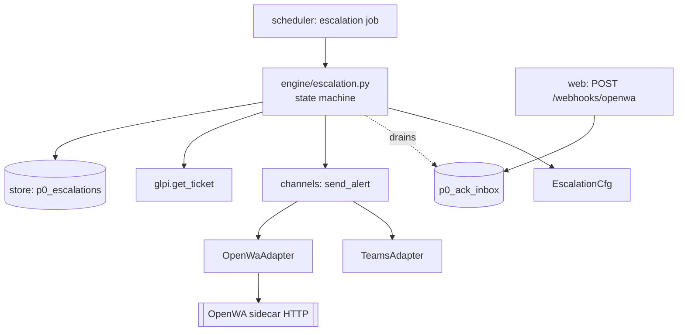
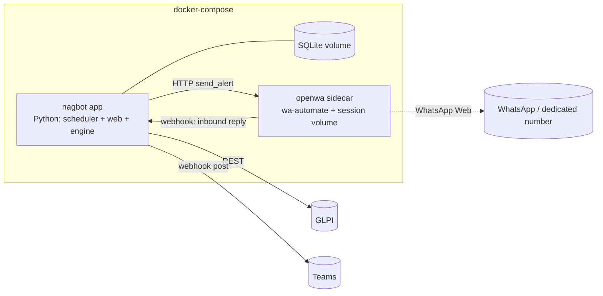
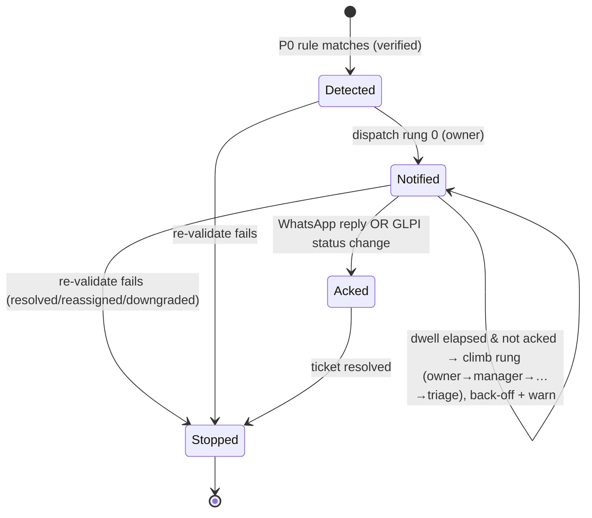

# Architecture Spine — Epic 7: Urgent P0 Escalation

## Design Paradigm

The app is a **layered pipeline behind ports-and-adapters**: GLPI client (port) → engine (aging/tiers/ownership) → digest builder → channel adapters (ports), orchestrated by a cron-driven `run` over a `_RUN_LOCK`, with all state in a SQLite store. Epic 7 **adds one new element without changing that paradigm**: a **polled, per-ticket escalation state machine** — a second, fast scheduler loop that reads P0 tickets, advances durable per-ticket escalation state, and dispatches through the *same* adapter ports. WhatsApp-Web itself lives outside the Python process, behind an HTTP port (the OpenWA sidecar).

Namespaces (new work slots into the existing tree):
- `engine/escalation.py` — the P0 state machine (pure logic; `now` injected).
- `channels/openwa.py` — the OpenWA adapter (HTTP client port).
- `store/repo.py` + `store/db.py` — new `p0_escalations` table + accessors.
- `glpi/` — extend `Ticket` + field-discovery (priority/urgency/impact) + single-ticket fetch.
- `run.py` / `scheduler.py` — the escalation job + its lock.
- `web/app.py` — inbound OpenWA webhook endpoint (ack replies).

## Inherited Invariants

| Inherited | From | Binds here |
| --- | --- | --- |
| Channel-adapter port `ChannelAdapter` (`send_digest`/`send_rollup`/opt. `begin_run`) returning `SendResult(channel, recipient, status, detail, cc)` | E2-S5 protocol; adapters + rate-cap reset E5/E6 (`channels/base.py`) | Escalation dispatch extends, not replaces, this port |
| Config split: secrets/endpoints in `EnvSettings` (env), tunables in `AppConfig` (yaml); frozen `RuntimeConfig` | project (`config.py`) | All new knobs follow this split |
| Store = SQLite, one table per concern, frozen `*Row` dataclasses, `escalations` table pattern | project (`store/`) | New escalation state mirrors it |
| `_RUN_LOCK` serialises the digest run; dry-run is the hard default | project (`run.py`) | Escalation loop must not share/deadlock this lock |
| North-star: **trust instrument — never cry wolf** | brief | Acceptance lens for every AD below |
| Messaging transport = self-hosted OpenWA (Node); calls deferred | research/brief | AD-2 boundary |

## Invariants & Rules

### AD-1 — Escalation runs as its own fast, locked scheduler loop
- **Binds:** E7-S3, E7-S4; all escalation execution.
- **Prevents:** piggybacking the once-daily digest cron (too slow for 5-min rungs) or standing up bespoke worker infra.
- **Rule:** a new APScheduler job (`escalation_cron`, **[ASSUMPTION] ~every 1 min**) runs the state machine under a **dedicated `_ESCALATION_LOCK`** — never `_RUN_LOCK`. Each tick is idempotent: it derives all actions from durable state + live GLPI, so a missed or doubled tick cannot double-notify (guarded by `last_notified_at` + dwell).

### AD-2 — OpenWA is an out-of-process HTTP sidecar; Python holds only a thin client
- **Binds:** E7-S1; the Python↔Node boundary.
- **Prevents:** spawning/embedding Node in the Python process; coupling WA-Web session lifecycle to nagbot.
- **Rule:** OpenWA runs as its own container (`openwa/wa-automate`) exposing its HTTP API; `OpenWaAdapter` is an `httpx` client to `OPENWA_URL`. The WA-Web session/QR and its persistence volume live **in the sidecar**. Nagbot never drives a browser.

### AD-3 — Per-ticket alerts use a new optional adapter capability with a composable fallback
- **Binds:** E7-S3, E7-S5; the adapter contract + fallback semantics.
- **Prevents:** overloading `send_digest` with synthetic single-ticket digests; and an ambiguous "OpenWA failed → Teams" that double-fires, silently no-ops, or hangs.
- **Rule:** adapters MAY implement `send_alert(alert: EscalationAlert, *, dry_run) -> SendResult` (optional, like `begin_run`). The engine dispatches down an ordered `alert_channels` list (default `[openwa, teams]`): a `sent`/`dry_run` result **stops**; only `failed` **or** a timeout past `alert_send_timeout` falls through to the next channel; `skipped` (adapter not configured/no-op) is **not** a delivery and also falls through. Every dispatch is deduped by `alert_key=(ticket_id, rung)` so one rung notifies once across channels. If no channel in the chain implements `send_alert`, the engine **fails fast** (config error) — a P0 must never silently no-op.

### AD-4 — Escalation state is a single-writer store table
- **Binds:** E7-S3, E7-S4; ownership of escalation state.
- **Prevents:** the digest run and the escalation loop both mutating escalation state; lost-update races.
- **Rule:** new table `p0_escalations` (mirrors `escalations`/`EscalationRow`): `ticket_id` PK, `p0_detected_at`, `current_rung`, `last_notified_at`, `acknowledged_at`, `acknowledged_by`, `stopped_reason`, `stopped_at`. **Only `engine/escalation.py` writes `p0_escalations`,** and only inside its locked tick (AD-1). The digest run may read but never write it. Inbound acks do **not** write this table directly (AD-7): the webhook appends to a separate `p0_ack_inbox`, which the engine drains inside its tick — so there is exactly one writer and no read-modify-write race on `current_rung`.

### AD-5 — P0 severity and every escalation tunable are config-driven
- **Binds:** E7-S2, E7-S3; severity + tunables.
- **Prevents:** hardcoded "P0" semantics or hardcoded cadence/roster (explicit user directive).
- **Rule:** a new `EscalationCfg` in `AppConfig` holds: the **P0 rule as a declarative, multi-field expression** (a combination, not a single field), per-rung `dwell` (default P0 = 5 min), the escalation chain, back-off curve, cadence, and `enabled`. The P0 rule is **OR-of-AND groups** over GLPI ticket fields: each group is a list of field conditions (`field op value`, e.g. `priority >= 5`, `urgency >= 4`, `impact >= 4`, `category in [...]`) ANDed together; a ticket is P0 if **any** group matches. A tiny safe evaluator (no `eval`) over the fetched fields — extensible to new fields without code change. Requires extending the GLPI `Ticket` model + `FieldMap` discovery to fetch the referenced fields (`priority`/`urgency`/`impact`/`category`, absent today). No severity or timing literal lives in code. **Default rule (confirmed against the live GLPI, 2026-07): `priority >= 5`** (searchoption id 3; 5/6 = Alta/Muy alta). Reality: severity is essentially unused today (all open tickets = priority 3; only 11 tickets ever hit P5/P6; type always Request), so detection depends on a **human marking convention** (triage sets priority 5/6 for a genuine P0) which AD-6 re-checks — ships safe (escalates nothing until a P0 is marked). A category safety-net is a deferred OR-group, tuned on data.

### AD-6 — No alert without a fresh live-state re-validation (the never-cry-wolf rule)
- **Binds:** E7-S2, E7-S4; reliability — the epic's whole point.
- **Prevents:** escalating a ticket that is already resolved, reassigned, downgraded, or was never a genuine P0.
- **Rule:** immediately before **every** rung dispatch the engine re-fetches the ticket via a **new `GlpiClient.get_ticket(id)`** single-fetch and re-verifies P0 + open + assignee. Any of resolved/closed/reassigned/downgraded → stop instantly, set `stopped_reason`, send nothing. **A fetch FAILURE (GLPI down) is never a stop** — leave state unchanged, do not dispatch, retry next tick; after `validation_grace` of continuous failure raise an ops "escalation blind" alert. The escalation loop holds a **long-lived GLPI session** (it must not `killSession` per fetch like the per-run digest client).

### AD-7 — Acknowledgement has two sources; fallback fires on a defined health signal
- **Binds:** E7-S4, E7-S5; ack ingestion + delivery resilience.
- **Prevents:** a reply-only "stop" with no live-state confirmation; a *silently* logged-out OpenWA swallowing a P0; a forged ack from any WhatsApp sender.
- **Rule:** an ack is (1) an **inbound WhatsApp reply** the OpenWA `-w` webhook POSTs to `POST /webhooks/openwa` on the nagbot FastAPI app, or (2) a **GLPI status change** seen on the AD-6 re-fetch. The webhook endpoint requires a **dedicated `OPENWA_WEBHOOK_SECRET`** (a new machine-auth path — NOT the human HTTP-Basic `DASHBOARD_PASSWORD`, and NOT `AUTH_EXEMPT`), and it accepts a reply as an ack **only if the sender number matches the ticket's roster**. It writes to `p0_ack_inbox` (AD-4), never to `p0_escalations`. Either ack source halts the climb; an ack reply MAY auto-move the GLPI status. **"OpenWA down" is a concrete signal** — a `failed`/timeout from `send_alert` (AD-3) or a failed session-health probe — on which the engine falls through to **Teams**; delivery is multi-channel, never sole-path WhatsApp.

### AD-8 — The escalation clock is cumulative, monotonic, and send-before-write
- **Binds:** E7-S3, E7-S4; rung timing correctness under missed/coalesced ticks and crashes.
- **Prevents:** a P0 escalating too slowly (only +1 rung after a long gap), double-notifying on clock skew, and a send/state-write torn by a crash.
- **Rule:** the target rung is a **cumulative function of `now − p0_detected_at` against the config dwell curve**, not `now − last_notified_at` (so a missed tick catches up), but **at most one *dispatch* per tick**. A tick uses a **monotonic clock** for elapsed time (no backward skew). For each dispatch: **send first, then record `send_log` + advance `p0_escalations` in one transaction**; `send_log` (kind `p0_alert`) is the source of truth for "did rung N already fire," so a crash between send and write cannot silently re-send the same `alert_key`.

### AD-9 — The OpenWA session and the escalation loop are operationally observable
- **Binds:** E7-S1, E7-S4, E7-S5; the operational envelope (session recovery, monitoring).
- **Prevents:** a dead WhatsApp session or a stalled escalation loop degrading silently — the failure mode the whole epic exists to avoid.
- **Rule:** the OpenWA sidecar's session state is exposed (its status endpoint) and **probed on a schedule**; a logged-out/needs-QR state raises an ops alert and flips delivery to the Teams fallback until recovered. `/healthz` reports escalation-loop liveness (last tick time) and OpenWA session health. QR re-auth is a **documented, alerted human runbook step** (not automated). The escalation job is pinned `max_instances=1, coalesce=True, misfire_grace_time` set, so overlapping/late ticks can't stack.

### Dependency direction



## Consistency Conventions

| Concern | Convention |
| --- | --- |
| Naming | `p0_escalations` + `p0_ack_inbox` tables; `P0EscalationRow`; `EscalationAlert`; `OpenWaAdapter`/`name="openwa"`; `EscalationCfg`; job `escalation`. |
| State & mutation | `p0_escalations` written **only** by `engine/escalation.py` inside its lock; webhook writes only append-only `p0_ack_inbox`; all timestamps UTC-aware; `now` injected (pure engine, testable). |
| Config | secrets/endpoints (`OPENWA_URL`, `OPENWA_WEBHOOK_SECRET`, dedicated number) → `EnvSettings`; all tunables → `AppConfig.escalation`. |
| Errors / dispatch | reuse `SendResult` statuses; P0 dispatches log to `send_log` with **`kind="p0_alert"`** (NOT the existing digest `kind="escalation"`, which is run-keyed manager-CC), with **nullable `run_id`** and structured `ticket_id`/`rung`. |
| DB concurrency | one shared SQLite connection/process (WAL); **no second connection** for the escalation loop; engine multi-statement reads run in one locked txn. `send_log` concurrent append from both loops is safe on the shared connection. |
| Field discovery | `field_cache` payload for `itemtype="Ticket"` is **additive/versioned** — the digest and escalation loops must not write mutually-incompatible shapes for the same row. |
| Idempotency | each tick derives actions from `(p0_escalations + p0_ack_inbox + live GLPI + monotonic now)`; `send_log` is the fired-rung source of truth; `alert_key=(ticket_id,rung)` dedupes. |
| Auth (webhook) | `POST /webhooks/openwa` requires `OPENWA_WEBHOOK_SECRET` (machine auth, distinct from `DASHBOARD_PASSWORD`); never added to `AUTH_EXEMPT`; a reply counts as an ack only if the sender matches the ticket roster. |

## Stack

| Name | Version |
| --- | --- |
| Python | >=3.11 (per pyproject) |
| APScheduler | existing (reused for the escalation job) |
| SQLite (WAL) | existing store |
| FastAPI | existing (hosts the OpenWA webhook) |
| httpx | existing (OpenWA HTTP client) |
| OpenWA sidecar | `openwa/wa-automate` Docker image (HTTP API + `-w` webhook) — **[ASSUMPTION] pin a specific tag at build** |

## Structural Seed

### Deployment / containers



### Escalation state machine (per ticket)



### Source tree (additions only)

```text
src/nagbot/
  engine/escalation.py     # NEW — P0 state machine (pure; now injected)
  channels/openwa.py       # NEW — OpenWaAdapter (httpx → sidecar), implements send_alert
  channels/base.py         # +send_alert optional capability, EscalationAlert
  store/db.py, repo.py     # +p0_escalations + p0_ack_inbox tables + rows + accessors
  glpi/models.py, fields.py, client.py  # +priority/urgency/impact, +get_ticket(id), long-lived session
  config.py                # +EscalationCfg (AppConfig), +OPENWA_URL/OPENWA_WEBHOOK_SECRET (EnvSettings)
  run.py, scheduler.py     # +escalation job (max_instances=1, coalesce), +_ESCALATION_LOCK
  web/app.py               # +POST /webhooks/openwa (OPENWA_WEBHOOK_SECRET) + escalation liveness in /healthz
```

## Capability → Architecture Map

| Story | Lands against |
| --- | --- |
| E7-S1 OpenWA adapter + sidecar | AD-2, AD-3 · `channels/openwa.py`, docker-compose, `OPENWA_URL` |
| E7-S2 P0 detect + verify | AD-5, AD-6 · GLPI `Ticket`/`FieldMap` extension, `get_ticket`, `EscalationCfg.p0_rule` |
| E7-S3 Roster + climbing ladder | AD-1, AD-3, AD-4, AD-5, AD-8 · `engine/escalation.py`, `p0_escalations`, escalation chain config, cumulative-dwell clock |
| E7-S4 Ack + re-validate/stop | AD-4, AD-6, AD-7, AD-8 · webhook + `p0_ack_inbox`, `get_ticket`, `stopped_reason`, send-before-write |
| E7-S5 Teams fallback | AD-3, AD-7, AD-9 · `TeamsAdapter.send_alert`, session-health probe |
| E7-S6 Transparency notice | (process/config) · `EscalationCfg.enabled` + staff notice; no new invariant |
| E7-S1 (ops) | AD-9 · OpenWA session-health probe, `/healthz` liveness, QR re-auth runbook |

## Deferred

- Per-tier SLA-configurable dwell **beyond** the MVP default (config seam exists; values are the extension).
- The phone-**call** rung (Cloud API Calling / Twilio) — a *third* `send_call`-style capability; out of Module 1.
- Stats/analytics on false-positive rate, ack times.

## Open Questions

- **AD-5 / AD-6 — RESOLVED (2026-07 probe):** GLPI field IDs confirmed (priority=3, urgency=10, impact=11, category/completename=7, status=12, type=14). Default P0 rule = `priority >= 5`. Severity fields are unused today → detection requires a **team marking convention** (triage sets priority 5/6 for a genuine P0); brief the operators. Follow-up (not a blocker): a category-based safety-net for business-critical systems, added once the stats module (E7-S9) shows real behavior.
- **Auto-move-status target:** which GLPI status an ack reply moves the ticket to (e.g. Processing/assigned) — confirm with ops.
- **Escalation-chain config shape:** extend `OwnerCfg.manager` into an ordered `escalation_chain` + a global `default_triage` owner — confirm the config schema in E7-S3.
