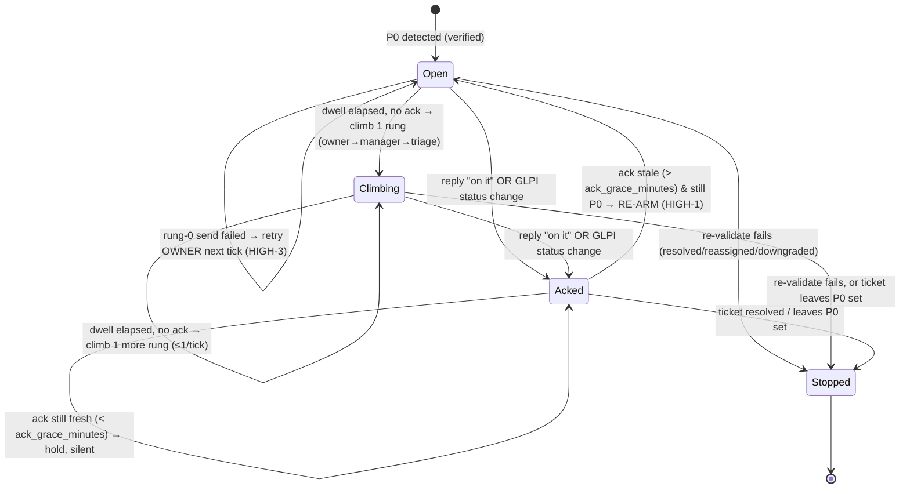

# Epic 7 — Urgent P0 Escalation (engineering reference)

This is the complete reference for nagbot's P0 escalation subsystem: what it does, how
the state machine works, every config knob, the never-cry-wolf guarantees it enforces,
and how to operate it. For the go-live checklist and the staff transparency notice, see
the **[runbook](e7-escalation-runbook.md)**. For the invariants this design is built on,
see the **[architecture spine](../_bmad-output/planning-artifacts/architecture/architecture-e7-urgent-p0-escalation/ARCHITECTURE-SPINE.md)** (AD-1…AD-9).

---

## 1. What it is

Epics 1–6 make ticket aging *visible* on a daily cadence. Epic 7 handles the opposite
end: a **critical incident that cannot wait for tomorrow's digest**. When a genuine P0 is
marked in GLPI, nagbot pages the ticket owner on WhatsApp within a minute, and — if nobody
acknowledges — climbs the chain (owner → manager → triage) every few minutes until someone
replies "on it" or the ticket is resolved.

The north star for every decision here is **"trust instrument — never cry wolf."** A P0
page reaches a person on their personal phone, out of hours. If nagbot pages for anything
that isn't a real, still-open P0 — or pages endlessly after someone has responded — people
stop trusting it, and the one time it matters they ignore it. Every rule below exists to
protect that trust: it errs toward *not* paging, but never toward *silently dropping* a
real P0.

**Transport.** Messaging goes through a self-hosted **OpenWA** sidecar (WhatsApp Web
automation, Node) reached over HTTP. This is an unofficial channel with a ban risk, which
is why sends are rate-capped and a dedicated throwaway number is mandatory. Placing a
phone **call** is deferred (OpenWA cannot call; that rung needs the official Cloud API or
Twilio — see §10).

---

## 2. How it runs — two independent loops

Epic 7 adds **one** new moving part to the existing pipeline: a second, faster scheduler
loop. It does not change the daily digest architecture.

| Loop | Cadence | Lock | Job |
| --- | --- | --- | --- |
| **Digest run** (Epics 1–6) | daily cron (08:00) | `_RUN_LOCK` | fetch → score → digest → send |
| **Escalation tick** (Epic 7) | every `cadence_seconds` (default 60s) | `_ESCALATION_LOCK` | fetch → detect P0 → tick → send |

The two loops never share a lock (AD-1) and never both write escalation state (AD-4). The
escalation job is pinned `max_instances=1, coalesce=True` so late or overlapping ticks
can't stack. Each tick is **idempotent**: it derives every action from durable state +
live GLPI, so a missed or doubled tick cannot double-page.

One tick, end to end (`run.execute_escalation_run`):

1. **Gate.** No-op unless `escalation.enabled` **and** `escalation.transparency_notice_given`
   are both true (§7). Acquire `_ESCALATION_LOCK` non-blocking; skip if a tick is still running.
2. **Fetch & detect.** Pull open tickets, evaluate the P0 rule (§4) → the current P0 set.
3. **Drain acks.** Apply any inbound WhatsApp replies sitting in the ack inbox (§6).
4. **Tick** (`escalation_tick`, pure). Decide what to open, climb, hold, re-arm, or stop.
5. **Persist unconditional state.** Anchors and stops land *before* re-validation, so an
   AD-6 stop writes to a persisted row instead of a no-op.
6. **Re-validate** (AD-6). Re-fetch each pending alert's ticket; drop/stop anything no
   longer P0. A GLPI fetch *failure* is never a stop — retry next tick.
7. **Dispatch** (send-then-persist). Send each surviving alert; persist its row only on a
   non-failed result. Honor the per-tick send cap.

---

## 3. The escalation state machine

State per ticket lives in one row of `p0_escalations` (`P0EscalationRow`). The engine
(`engine/escalation.py`) is pure — `now` is injected — so the whole machine is unit-testable
without a clock, a DB, or a network.



**Open.** First time a ticket is seen as P0, the engine writes an anchor row
(`p0_detected_at = now`, `current_rung = 0`) and queues a rung-0 page to the owner. The
anchor is persisted *regardless of whether the send succeeds* — otherwise a failing owner
would re-open every tick and the dwell clock could never advance (the exact failure the
subsystem exists to prevent).

**Climb.** The target rung is a **cumulative** function of `now − p0_detected_at` against
the dwell curve (AD-8) — not `now − last_notified_at` — so a missed tick catches up. But
the engine climbs **at most one rung per tick**, so a long outage can't jump straight to
triage. Each climb pages the next reachable person in the chain (§5).

**Ack / hold.** A reply "on it" from a roster number (or a GLPI status change) marks the
row acknowledged and the ladder goes silent.

**Re-arm** *(HIGH-1)*. An ack is not permanent silence. If the ticket is **still P0** and
the ack is older than `ack_grace_minutes` (default 30), the engine re-opens from rung 0 —
clearing the ack and resetting the clock. Someone said "on it" half an hour ago and it's
still broken; page again.

**Stop.** The ticket leaving the P0 set (resolved / reassigned / downgraded), detected
either by the tick's set-difference or by the AD-6 re-validation, stops the escalation
with a recorded `stopped_reason` and sends nothing further.

---

## 4. P0 detection (AD-5 / AD-6)

**What counts as P0 is config, never code.** `escalation.p0_rule` is an **OR-of-AND**
expression over GLPI ticket fields evaluated by a tiny safe evaluator (no `eval`):

```yaml
escalation:
  p0_rule:
    - - { field: priority, op: ">=", value: 5 }   # group 1: priority >= 5
    # a ticket is P0 if ANY group matches; conditions within a group are ANDed
```

Supported fields: `priority`, `urgency`, `impact`, `category`, `status`, `type`. Operators:
`>= > <= < == != in`.

**The shipped default is `priority >= 5`** (GLPI searchoption 3; 5/6 = Alta / Muy alta),
confirmed against the live GLPI. In practice severity is barely used there — every open
ticket is priority 3 today — so detection depends on a **human marking convention**: triage
sets a genuine P0 to priority 5/6. This is deliberate and ships **safe**: with the default
rule, nagbot escalates *nothing* until a real P0 is marked. (Verified live: 175 open
tickets, 0 P0.)

**Re-validation (AD-6) is the never-cry-wolf keystone.** Immediately before *every* rung
dispatch the engine re-fetches the ticket (`GlpiClient.get_ticket`) and re-checks P0 +
open. Resolved/closed/reassigned/downgraded → stop instantly, page nobody. A GLPI *fetch
failure* is never treated as a stop — state is left unchanged and retried next tick, so a
GLPI outage can't silently cancel a real P0.

---

## 5. The escalation chain (roster)

`escalation_chain(ticket)` builds the ordered recipient list per ticket:

1. **owner** — the ticket's resolved assignee (`OwnerCfg.whatsapp`),
2. **manager** — the owner's `manager` (matched by email), if any,
3. **default triage** — `escalation.default_triage`: an owners-key or a raw E.164 number.

Adjacent duplicate numbers collapse. A rung with **no WhatsApp number** is recorded but
not dispatched — the ladder advances *past* it silently so a missing manager number can't
stall the climb. Numbers are validated E.164 at config load.

---

## 6. Acknowledgement pipeline (AD-4 / AD-7)

Acks have **two sources**, and neither writes `p0_escalations` directly — that table has
exactly one writer (the engine), so there's no read-modify-write race on `current_rung`.

**(1) Inbound WhatsApp reply.** The OpenWA sidecar's `-w` webhook POSTs each inbound
message to `POST /webhooks/openwa`. That endpoint:

- requires the dedicated `OPENWA_WEBHOOK_SECRET` (machine auth — **not** the human
  dashboard password, and **never** in the auth-exempt list);
- records the reply only if the sender number matches the ticket roster (a forged ack from
  a random number is ignored);
- **only accepts anything while escalation is live** (`enabled` AND notice given) — before
  go-live the endpoint drops inbound silently so a public webhook can't fill the inbox
  *(SEC-HIGH-1)*;
- appends to the append-only `p0_ack_inbox`, never to `p0_escalations`.

The engine **drains** the inbox inside its locked tick: a reply from a roster number acks
every active, un-acked escalation whose chain includes that number. Unmatched acks are
retained briefly (an ack can arrive before its escalation is anchored) and swept after
`ack_ttl_minutes`. Processed acks are **physically deleted** so the inbox stays bounded
*(SEC-HIGH-1)*.

**(2) GLPI status change.** Seen on the AD-6 re-fetch — the ticket moving out of the P0
set stops the escalation regardless of any reply.

---

## 7. Compliance gate (AD-5 / E7-S6)

Because a P0 page reaches personal phones, escalation stays **doubly gated**: it pages
nobody unless **both** `escalation.enabled` and `escalation.transparency_notice_given` are
true. The second flag is the operator's on-the-record attestation that staff were given
the one-time transparency notice (LOPDP/consent basis; there is **no P0 opt-out** — P0
reachability is part of the role). If `enabled` is set but the notice flag is not, nagbot
logs one warning and stays silent. The exact notice text and the recording step are in the
[runbook](e7-escalation-runbook.md).

---

## 8. Configuration reference

All tunables live under `escalation:` in `config/nagbot.yaml` (`EscalationCfg`). Secrets
and endpoints are environment variables (`EnvSettings`). Everything ships safe-by-default.

### `escalation:` (YAML)

| Key | Default | Meaning |
| --- | --- | --- |
| `enabled` | `false` | Master switch. With the notice flag, gates all paging. |
| `transparency_notice_given` | `false` | Attestation that staff were notified (§7). Both required. |
| `p0_rule` | `[[priority >= 5]]` | OR-of-AND P0 expression (§4). |
| `dwell_minutes` | `5.0` | Minutes at a rung before climbing to the next. |
| `cadence_seconds` | `60` | How often the escalation tick runs. |
| `default_triage` | `null` | Final chain rung: an owners-key or an E.164 number. |
| `alert_channels` | `[openwa, teams]` | Ordered dispatch chain. Teams is the always-on fallback. |
| `alert_send_timeout` | `15` | Per-send HTTP timeout (s). A hung OpenWA fails → Teams. |
| `max_alerts_per_tick` | `10` | **Ban-avoidance cap** on sends per tick; overflow defers *(SEC-HIGH-2)*. |
| `ack_grace_minutes` | `30` | Re-arm a still-P0 escalation this long after a stale ack *(HIGH-1)*. |
| `ack_ttl_minutes` | `120` | Retain an unmatched inbound ack this long, then sweep it. |

Invalid `alert_channels` (anything but `openwa`/`teams`) fail loud at config load, not at
outage time.

### Environment variables (`EnvSettings`)

| Var | Meaning |
| --- | --- |
| `OPENWA_URL` | HTTP base URL of the OpenWA sidecar (e.g. `http://openwa:8085`). |
| `OPENWA_WEBHOOK_SECRET` | Authenticates inbound acks at `POST /webhooks/openwa`. |
| `OPENWA_IMAGE_TAG` | Pin the sidecar image to a specific tag/digest — never `latest` (AD-9). |
| `TEAMS_WEBHOOK_URL` | Reused for the Teams fallback channel. |

---

## 9. Never-cry-wolf guarantees & the epic-wide hardening

The subsystem was built story by story (E7-S1…S6), each with an adversarial review. A
final review of the *whole* epic then looked for **emergent** defects — ones that only
appear from the interaction of stories, invisible inside any single one. It found five,
every one of them a north-star inversion (either a silenced real P0 or unbounded growth).
All are fixed and regression-tested:

| ID | Defect | Fix |
| --- | --- | --- |
| **HIGH-1** | A stale ack silenced a still-P0 ticket **forever** — "on it" and then nothing. | Re-arm from rung 0 once the ack is older than `ack_grace_minutes`; a fresh ack still holds. |
| **HIGH-2** | When every channel failed, the undelivered P0 was **logged at no level** — a page nobody saw and nobody knew was missed. | Loud `ERROR` on any fully-undelivered alert; row not persisted, so the tick retries. |
| **HIGH-3** | A rung-0 open whose send failed was **skipped**, paging the manager before the owner ever heard. | Retry the owner at rung 0 (`current_rung == 0 and last_notified_at is None`) until it lands. |
| **SEC-HIGH-1** | The public ack webhook recorded inbound **before go-live**, and processed acks were kept forever — unbounded inbox. | Webhook drops inbound unless escalation is live; processed acks are physically `DELETE`d. |
| **SEC-HIGH-2** | Unbounded unofficial-channel sends per tick risked a **WhatsApp ban** (which would take the whole channel down). | `max_alerts_per_tick` cap; overflow **defers** to the next tick (never dropped — HIGH-3 retries the un-notified anchors). |

Plus the invariants baked in from the start: the anchor persists even on a failed rung-0
send (a failing owner can't reset the clock); send-before-write with `send_log` as the
fired-rung source of truth (a crash between send and write can't double-page); the
single-writer table; and the AD-6 re-validation before every page.

Also hardened in deployment: the OpenWA sidecar's **unauthenticated** EASY API is published
to `127.0.0.1` only (not `0.0.0.0`) — nagbot reaches it over the compose network, so the
LAN cannot send WhatsApp messages as our number.

---

## 10. Failure modes — what happens when…

| Situation | Behaviour |
| --- | --- |
| OpenWA session logged out / banned | `send_alert` fails/times out → **falls through to Teams** (AD-3/AD-7). No sole-path WhatsApp. |
| GLPI down at re-validation | No stop, no page; state unchanged; **retry next tick** (AD-6). A real P0 survives a GLPI blip. |
| Owner never answers | Ladder climbs owner → manager → triage, one rung per `dwell_minutes`. |
| Owner replies "on it", ticket stays broken | Holds silent for `ack_grace_minutes`, then **re-arms** (HIGH-1). |
| Send fails for the rung-0 owner page | Anchor persists; owner **retried at rung 0** next tick (HIGH-3), never skipped. |
| More P0s than the tick cap | First `max_alerts_per_tick` sent; the rest **defer** to the next tick (SEC-HIGH-2). |
| Every channel fails for a page | `ERROR` logged; row not persisted; **retried next tick** (HIGH-2). |
| Ticket resolved mid-escalation | Stopped instantly on the next re-validate or set-difference; nobody paged. |
| Escalation not yet live | Both gate flags off → pages nobody; the ack webhook drops inbound. |

---

## 11. Operations & observability (AD-9)

- **`/healthz`** reports escalation-loop liveness (last tick time) and OpenWA session health.
- **`send_log`** records every P0 page with `kind="p0_alert"`, nullable `run_id`, and the
  rung in the detail — the audit trail and the fired-rung source of truth.
- **Logs to watch** (`nagbot.escalation` logger):
  - `ERROR … UNDELIVERED …` — a P0 page no channel accepted. **Investigate immediately.**
  - `WARNING … per-tick alert cap … deferring …` — sustained volume; consider raising the cap or triaging.
  - `WARNING … transparency notice not acknowledged …` — `enabled` is on but the notice flag isn't; nothing is paging.
- **QR re-auth** for a logged-out OpenWA session is a **documented human runbook step**, not automated — the sidecar owns the WhatsApp-Web session and its persistence volume.

---

## 12. Deferred / roadmap

Explicitly out of Module 1 (config seams exist where noted):

- **The phone-call rung** — a genuine call for "very urgent". OpenWA *cannot* place calls;
  this needs the official WhatsApp Cloud API Calling or Twilio Voice. A future third
  adapter capability alongside `send_alert`.
- **Per-tier SLA-configurable dwell** beyond the single MVP default (the curve is a config
  extension, not new code).
- **Stats / analytics** — false-positive rate, time-to-ack — which would in turn inform a
  category-based P0 safety-net rule.
- **Proactive OpenWA session-health probe** (beyond the reactive failover already in place).

---

## 13. Where things live

| Concern | File |
| --- | --- |
| State machine (pure) | `src/nagbot/engine/escalation.py` |
| P0 detection | `src/nagbot/engine/p0.py` |
| Runner (fetch → tick → dispatch) | `src/nagbot/run.py` (`execute_escalation_run`) |
| OpenWA adapter | `src/nagbot/channels/openwa.py` |
| Teams fallback | `src/nagbot/channels/teams.py` |
| State tables + accessors | `src/nagbot/store/repo.py`, `store/db.py` |
| Ack webhook | `src/nagbot/web/app.py` (`POST /webhooks/openwa`) |
| Config | `src/nagbot/config.py` (`EscalationCfg`) |
| Sidecar wiring | `docker-compose.yml` (`openwa` service) |
| Tests | `tests/unit/test_escalation.py`, `tests/integration/test_web.py` |
| Go-live checklist + notice | [`docs/e7-escalation-runbook.md`](e7-escalation-runbook.md) |
| Invariants (AD-1…AD-9) | [architecture spine](../_bmad-output/planning-artifacts/architecture/architecture-e7-urgent-p0-escalation/ARCHITECTURE-SPINE.md) |
| Per-story acceptance/dev records | `docs/stories/e7-s1…s6-*.md` |
